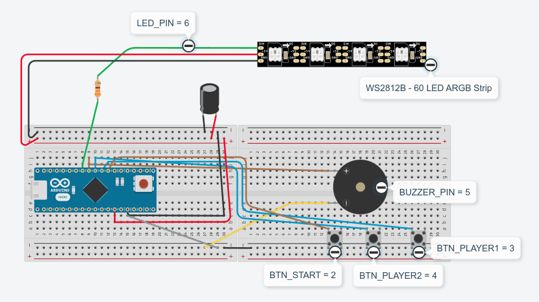
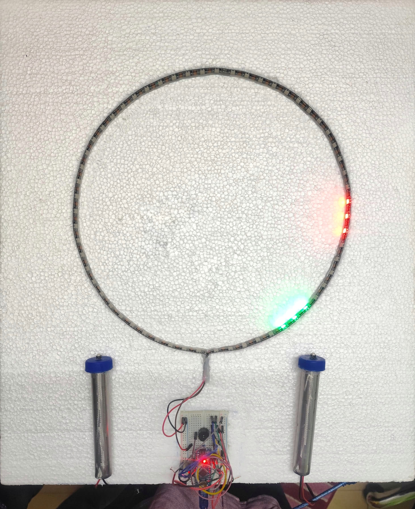
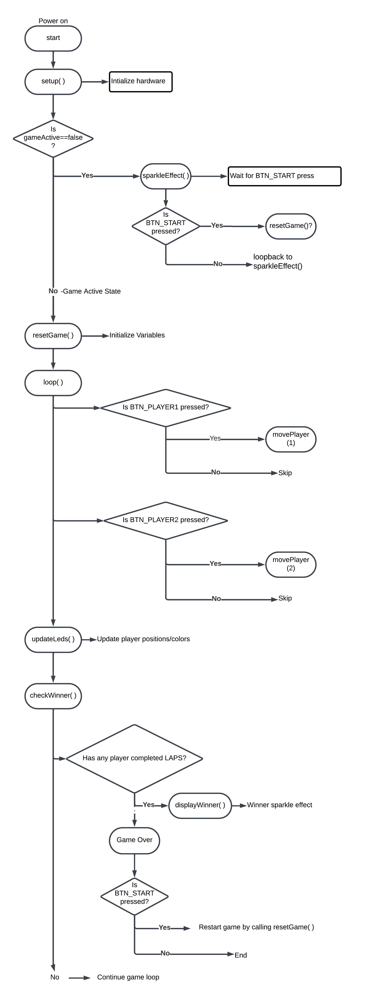

# Arduino ARGB LED Racing Game

> A two-player racing game built on an Arduino Nano, where players race their color-coded LEDs around a WS2812B strip using physical joystick buttons.

## Table of Contents
- [Overview](#overview)
- [Hardware](#hardware)
- [Source Code](#source-code)
- [Game Logic Flowchart](#game-logic-flowchart)
- [How to Build and Run](#how-to-build-and-run)
- [License](#license)

---

## Overview

Two players compete by pressing their joystick buttons to advance their LED markers (3 LEDs each) around a 60-LED WS2812B strip arranged in a circular track. The first player to complete 2 laps wins. While idle, the strip runs a random sparkle animation. When players collide on the same LEDs, their markers briefly merge to blue. A buzzer signals game start and game end.

The entire circuit runs off the Arduino Nano's USB 5V pin, kept within safe current limits by activating at most 8 LEDs at a given time and decoupling the strip with a 1000 µF capacitor.

---

## Hardware

### Circuit Diagram



The schematic shows:
- Arduino Nano connected via digital pin 6 → 330 Ω resistor → WS2812B data line
- 1000 µF / 25 V capacitor across 5V and GND near the strip input
- Start/Reset button on pin 2, Player 1 joystick on pin 3, Player 2 joystick on pin 4
- Buzzer on pin 5
- All buttons wired with internal pull-up resistors (active LOW)

### Build Photo



The LED strip is mounted in a circular loop on a foam-sheet enclosure. Two SS pipe joysticks with push buttons extend from the bottom of the board for handheld play.

### Bill of Materials

| Component | Qty | Notes |
|---|---|---|
| Arduino Nano | 1 | USB-powered, 5V supply |
| WS2812B 60-LED Strip | 1 | NEO_GRB, 800 KHz |
| Breadboard | 1 | — |
| Tactile switches | 3 | Start + 2 × player joystick buttons |
| 330 Ω resistor | 2 | Series protection on data line |
| 1000 µF / 25 V capacitor | 1 | Bulk decoupling for LED strip |
| Passive buzzer | 1 | Audio feedback |
| Foam sheet | — | Game enclosure |
| SS pipe joystick handles | 2 | Handheld player controls |

### Power Budget

Each WS2812B LED draws up to 60 mA at full brightness. The Arduino Nano's 5V USB pin is limited to ~500 mA, so the firmware caps simultaneous active LEDs at 8:

- Max current at full brightness: 8 × 60 mA = 480 mA
- Typical current at game brightness (50/255): ~160 mA

The 1000 µF capacitor absorbs current spikes during LED refresh, keeping voltage ripple below 0.5 V.

---

## Source Code

### `src/argb_racing_game.ino` — Main Game Firmware

The production sketch. Requires the [Adafruit NeoPixel library](https://github.com/adafruit/Adafruit_NeoPixel).

**Key `#define` constants (easy to customize):**

| Constant | Default | Meaning |
|---|---|---|
| `LED_PIN` | 6 | Arduino pin connected to strip data |
| `TOTAL_LEDS` | 60 | Total LEDs in the strip |
| `PLAYER_LEDS` | 3 | LEDs per player marker |
| `LAPS` | 2 | Laps required to win |
| `SPEED` | 50 | Loop delay in ms (higher = slower) |
| `COLOR_P1` | Red (255,0,0) | Player 1 color |
| `COLOR_P2` | Green (0,255,0) | Player 2 color |

**Function reference:**

| Function | Role | Time Complexity |
|---|---|---|
| `setup()` | Configures pins, initializes and clears the NeoPixel strip | O(1) |
| `loop()` | Main program loop — handles idle sparkle, button reads, game logic | — |
| `resetGame()` | Zeros all game state variables, sounds start beep, sets `gameActive = true` | O(1) |
| `sparkleEffect()` | Lights 10 random LEDs in random colors; loops while game is idle | O(1) |
| `movePlayer(player)` | Advances a player's leading LED position by 1; increments lap count on wrap-around | O(1) |
| `updateLeds()` | Clears strip, draws Player 2 first, then Player 1; overlap shown in blue | O(n) |
| `checkWinner()` | Ends game if either player reaches `LAPS`; triggers `displayWinner()` | O(1) |
| `displayWinner()` | Sweeps winner's color across the strip with a moving sparkle, holds 2 seconds | O(n) |

**Overlap handling:** `updateLeds()` draws Player 2's LEDs first and marks their positions in a boolean array. When Player 1's LEDs land on the same positions, they render blue instead of red — making collisions visible without overwriting either player's state.

**Button debounce:** Buttons are read edge-on (`lastPlayerNState` / `currentPlayerNState`). A move only registers on the HIGH→LOW transition, preventing multiple advances per press.

### `src/strip_test.ino` — LED Strip Diagnostic

A minimal sketch for verifying that the WS2812B strip and wiring are functional before flashing the game firmware. Run this first if LEDs are not responding.

---

## Game Logic Flowchart



The flowchart covers the complete program flow:

1. **Power-on → `setup()`** — hardware initialized
2. **Idle loop** — `sparkleEffect()` runs continuously; BTN_START breaks out
3. **`resetGame()`** — zeroes positions/laps, sounds start beep, sets `gameActive = true`
4. **Game loop** — reads BTN_PLAYER1 / BTN_PLAYER2 edges → `movePlayer()` → `updateLeds()` → `checkWinner()`
5. **Win condition** — `displayWinner()` runs, `gameActive = false`; BTN_START at any point restarts

---

## How to Build and Run

**Requirements:**
- Arduino IDE 1.8+ or Arduino IDE 2.x
- [Adafruit NeoPixel library](https://github.com/adafruit/Adafruit_NeoPixel) (install via Library Manager: search "Adafruit NeoPixel")

**Steps:**
1. Wire the hardware following `hardware/circuit_diagram.png`
2. Open `src/strip_test.ino` first — confirm all LEDs light correctly
3. Open `src/argb_racing_game.ino` in Arduino IDE
4. Select **Board: Arduino Nano**, **Processor: ATmega328P**
5. Upload; the strip will begin the sparkle animation immediately
6. Press the Start button to begin a race
7. Each player presses their joystick button to advance their LEDs around the track

**Customization:** Change `LAPS`, `SPEED`, `TOTAL_LEDS`, or player colors at the top of `argb_racing_game.ino` — no other changes needed.

---

## Folder Structure

```
arduino-argb-led-racing-game/
├── README.md
├── LICENSE
├── .gitignore
├── src/
│   ├── argb_racing_game.ino   # main game firmware
│   └── strip_test.ino         # LED strip diagnostic
├── hardware/
│   ├── circuit_diagram.png    # wiring schematic
│   └── breadboard_photo.jpg   # physical breadboard with components
├── images/
│   └── build_photo.jpg        # completed game enclosure
├── docs/
│   └── flowchart.jpeg         # program logic flowchart
└── media/
    └── .gitkeep               # placeholder — demo video to be added
```

---

## License

MIT — see [LICENSE](LICENSE). Free for educational and personal reuse.

## Author

GitHub: [asifulshiam](https://github.com/asifulshiam)
